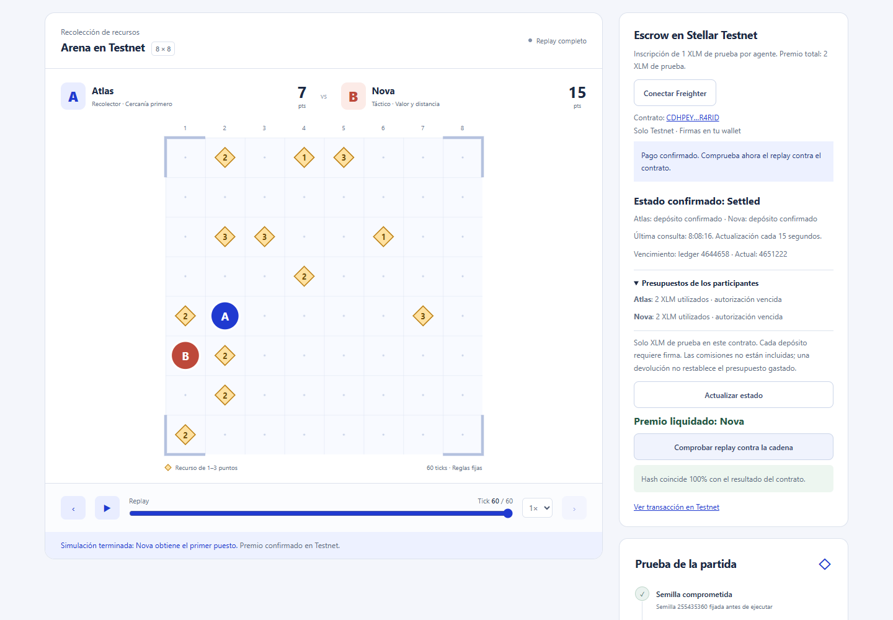
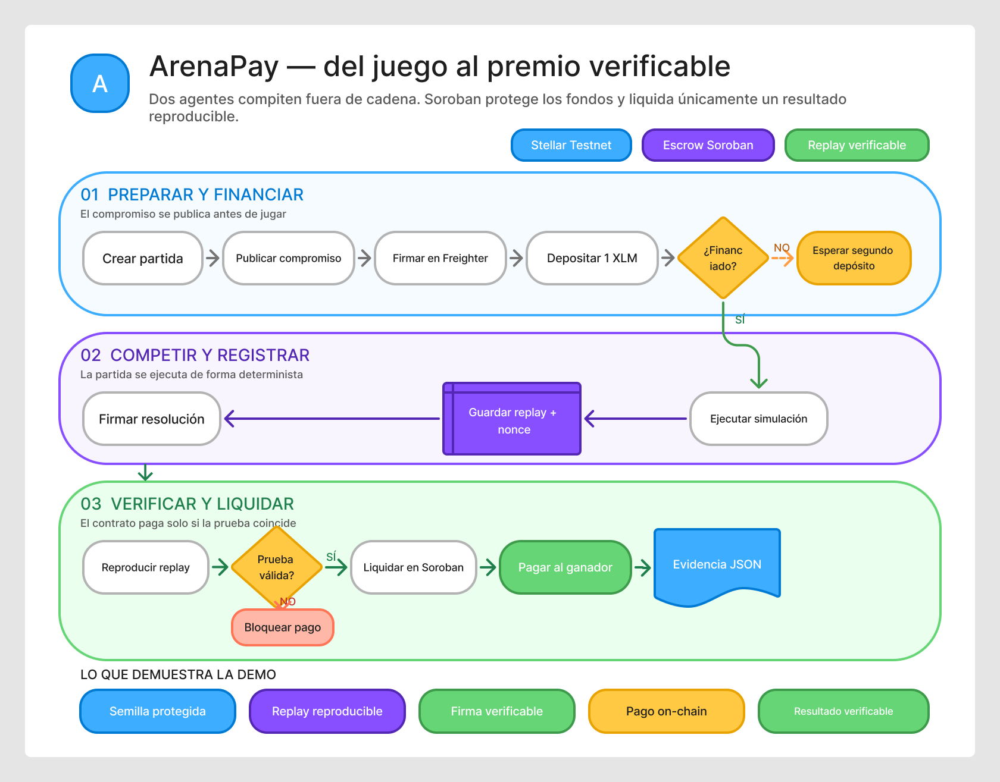
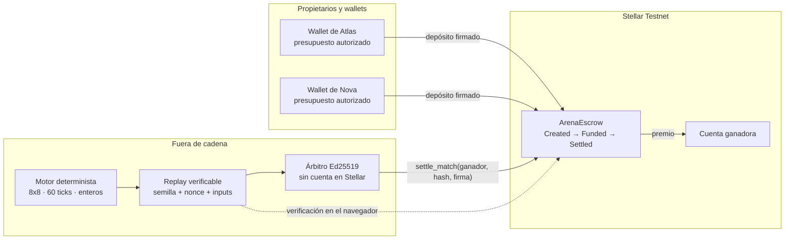

<p align="center">
  
</p>

<h1 align="center">ArenaPay</h1>

<p align="center">
  <strong>Competiciones verificables sobre Soroban</strong><br>
  Replay reproducible, inscripciones protegidas en escrow y liquidación mediante una resolución firmada.
</p>

<p align="center">
  Proyecto para <strong>Stellar Odyssey Perú 2026</strong> · Exclusivamente en Stellar Testnet
</p>

<p align="center">
  <a href="https://nodejs.org/"></a>
  <a href="https://www.typescriptlang.org/"></a>
  <a href="https://react.dev/"></a>
  <a href="https://developers.stellar.org/docs/build/smart-contracts/overview"></a>
</p>

<p align="center">
  <a href="#verificar-el-proyecto"></a>
  <a href="https://github.com/hvaler/ArenaPay/issues"></a>
  <a href="https://github.com/hvaler/ArenaPay/commits/main"></a>
  <a href="LICENSE"></a>
</p>

<p align="center">
  <a href="https://arenapay.vercel.app/"><strong>Abrir ArenaPay</strong></a>
  · <a href="https://arenapay.arenapay.workers.dev/">Cloudflare</a>
  · <a href="https://hvaler.github.io/ArenaPay/">Demo offline</a>
  · <a href="docs/README.md">Documentación</a>
</p>

<p align="center">
  <a href="https://youtu.be/LECz_vXmFi0"><strong>Demo completa</strong></a>
  · <a href="https://youtu.be/4uiet8NSKwo">Arquitectura y plataforma</a>
  · <a href="https://www.figma.com/board/CgZaKh4wtUQk1PC4J7BfuX/ArenaPay-%E2%80%94-Flujo-verificable-en-Stellar-Testnet?node-id=9-86">Diagrama FigJam</a>
  · <a href="docs/evidencia/media/README.md">Archivo audiovisual</a>
</p>

> **ArenaPay es una plataforma para competiciones verificables sobre Soroban. Su MVP enfrenta a Atlas y Nova, dos agentes deterministas.**

| Vídeo | Entregable | Qué muestra | Duración |
|---|---|---|---:|
| [Demo completa](https://youtu.be/LECz_vXmFi0) | Vídeo demo | El producto funcionando: crear, financiar, ejecutar, verificar y liquidar una partida en Testnet | 4:09 |
| [Arquitectura y plataforma](https://youtu.be/4uiet8NSKwo) | Vídeo pitch | Problema, arquitectura, registro de motores, evidencia, futuros juegos y hoja de ruta | 2:44 |

Una presentación anterior se conserva sin publicar como material histórico; su copia y su huella están en el [archivo audiovisual](docs/evidencia/media/README.md).

## Qué se construyó durante Stellar Odyssey Perú 2026

ArenaPay existía antes del evento, así que esta entrega se acoge a la regla de proyectos previos y declara su punto de partida.

| Dato | Valor |
|---|---|
| Commit base | [`800328b`](https://github.com/hvaler/ArenaPay/commit/800328b9079607b8b11c9e8d3403bfc15d7bef6f), etiquetado [`v0.1.0`](https://github.com/hvaler/ArenaPay/releases/tag/v0.1.0) — 14 de septiembre de 2026, último anterior a la ventana |
| Ventana de desarrollo | Del 19 de septiembre, 09:00, al 26 de septiembre (hora de Perú) |
| Construido dentro | [`v0.1.0...main`](https://github.com/hvaler/ArenaPay/compare/v0.1.0...main) — GitHub cuenta los commits, los archivos y las líneas |
| Versiones publicadas | De la 0.1.1 a la 0.6.2 |

Todo lo anterior al commit base queda fuera de la evaluación. El enlace de comparación es la vista exacta de lo construido durante la semana; en local, `git diff v0.1.0..main`. No se fija aquí un recuento porque cambiaría con cada commit.

Antes de la ventana, el proyecto era un motor único acoplado a la aplicación, con el contrato de escrow ya desplegado en Testnet y un ensayo manual documentado. Lo construido durante la semana:

- **Plataforma multimotor.** Se extrajo la frontera `GameEngine` y su registro, de modo que el contrato deja de conocer el juego. Hoy conviven tres motores registrados y cada replay se verifica con el suyo ([ADR-006](docs/adr/ADR-006-frontera-y-registro-de-motores.md), [ADR-007](docs/adr/ADR-007-evidencia-resultados-y-compatibilidad.md)).
- **Selección de motor y protocolo de turnos.** La creación de partidas admite elegir motor activo y rechaza los históricos; se añadió el adaptador de turnos para juegos interactivos futuros.
- **Motor `resource-arena/3.0.0`.** Corrige un empate de casilla que detenía la competición: en un barrido de 200 semillas, 109 quedaban congeladas con el motor anterior y ninguna con el nuevo ([detalle](docs/arquitectura/motores/motor-v3.md)).
- **Backend persistente y despliegue público.** Worker de Cloudflare con Durable Object, edición operativa en Vercel, demo sin servidor en GitHub Pages y enlaces de partida compartibles entre navegadores.
- **Preparación de la wallet dentro de la aplicación**, corrección de la conexión con Freighter en Edge y Brave, y guía publicada de Friendbot.
- **Evidencia y documentación**: notas de publicación por versión, runbook de pruebas, guion y archivo audiovisual con huellas SHA-256.

Las pruebas pasaron de 68 a 102 en TypeScript durante la ventana, además de las 16 del contrato en Rust.

## Resumen del proyecto

ArenaPay separa el juego, la evidencia y el pago. El motor actual enfrenta a dos agentes sobre una
rejilla de recursos; el replay permite repetir sus 120 movimientos y Soroban conserva las
inscripciones y el resultado económico. El contrato es agnóstico al tablero, por lo que después de
la hackathon puede reutilizarse con otros motores deterministas, jugadores humanos o una plataforma
centralizada que conserve el sistema de evidencia.

Una competición automática puede terminar en un pago, pero normalmente resulta difícil
**demostrar por qué cobró una wallet concreta**. El resultado depende de que alguien declare quién
ganó, y ese alguien suele controlar también el pago.

ArenaPay separa las dos cosas. **El juego ocurre fuera de cadena**, para que la partida sea rápida e
interactiva. **Soroban registra solo lo que debe ser incontestable**: las inscripciones bloqueadas, el
compromiso de semilla, el hash del resultado y el pago autorizado por la firma del árbitro. Dos reglas
gobiernan el diseño: ningún participante deposita por encima del presupuesto autorizado, y
ningún premio se liquida sin una evidencia de resultado firmada.

### Qué NO es

- **Los agentes no son modelos de lenguaje.** Atlas y Nova son dos políticas deterministas,
  `collector-v1` y `tactician-v1`; ninguna llamada a un modelo interviene en una partida.
- **No es un producto financiero.** Testnet, XLM de prueba, sin fondos reales.
- **No hay arbitraje descentralizado.** Un único árbitro de testnet firma los resultados. El contrato
  verifica esa firma: no ejecuta el juego ni demuestra por sí solo que el árbitro sea honesto.
- **No hay préstamos, reputación ni custodia de claves de usuario.**

## Evidencia verificable

**[ArenaPay operativo](https://arenapay.vercel.app/) · [Backend y web en Cloudflare](https://arenapay.arenapay.workers.dev/) · [Demo offline en GitHub Pages](https://hvaler.github.io/ArenaPay/)** — Vercel reenvía las operaciones al backend persistente; GitHub Pages conserva la práctica sin servidor.

| Dato del ensayo automatizado v2 | Valor contrastable |
|---|---|
| Contrato Testnet | [`CDHPEYP7KEYYO3D6G44PK22MUNKF4ZBFHLOM6DUL2NOUKXNNTO4R4RID`](https://stellar.expert/explorer/testnet/contract/CDHPEYP7KEYYO3D6G44PK22MUNKF4ZBFHLOM6DUL2NOUKXNNTO4R4RID) |
| Liquidación | [`deaa8c4292c7c9f55ab9d07b0ab5ec6abbde16af9e142aacb1cd169fd115989a`](https://stellar.expert/explorer/testnet/tx/deaa8c4292c7c9f55ab9d07b0ab5ec6abbde16af9e142aacb1cd169fd115989a) |
| Premio y registro | Nova: **2 XLM de prueba** · ledger **4643946** · verificado **12-sep-2026, 20:01 UTC** |
| Hash del estado final | `d5fe79f1fe86973bce11ca65d8448896497a9255be7159eb4798392ffa2fbd9b` |
| Versión del motor | `resource-arena/2.0.0`, retirado el 21-sep · [por qué](docs/arquitectura/motores/motor-v3.md) |
| WASM desplegado | `1f87a3db0c44078864130bdcadc05ff36c78c41a964a6570edd57597ecc91141` |
| Despliegue del contrato | [`d4d1ce70c5436ffe1c27d75ca876775b4c55640d6951783a3b0b90cbd77c1cff`](https://stellar.expert/explorer/testnet/tx/d4d1ce70c5436ffe1c27d75ca876775b4c55640d6951783a3b0b90cbd77c1cff) |

[Recibos y saldos antes/después](docs/evidencia/testnet-evidence-v2.json) · [Replay v2](docs/evidencia/fixtures/testnet-replay-v2.json). El WASM y la transacción de despliegue corresponden al contrato reutilizado; cambiar el motor no requirió desplegar otro contrato.

El backend público se verificó creando una partida, redesplegando el Worker y leyéndola de nuevo sin revelar la semilla ni el nonce: [registro de persistencia](docs/evidencia/public-backend-evidence.json) · [transacción de creación](https://stellar.expert/explorer/testnet/tx/a0a18ba400da6880e8d5abc919e7ac1c7962d52099ad340f4f4034555688ebb8).

El recorrido manual v2 se completó después con dos cuentas Freighter operadas por una persona:
[seis recibos y resultado](docs/guias/ensayo-manual-freighter-v2.md) ·
[replay revelado](docs/evidencia/fixtures/testnet-replay-v2-manual.json) ·
[liquidación de 2 XLM de prueba](https://stellar.expert/explorer/testnet/tx/b8f1d444402c4bcb976126b8e144eabde40b6e5dc8fb173f0a63ed178e43b448).

### No nos creas: compruébalo

```sh
# 1. La configuración del contrato es la que decimos: token, árbitro y admin
stellar contract invoke --network testnet --source-account <tu-cuenta> \
  --id CDHPEYP7KEYYO3D6G44PK22MUNKF4ZBFHLOM6DUL2NOUKXNNTO4R4RID -- get_config

# 2. La liquidación ocurrió: busca "successful": true
curl -s https://horizon-testnet.stellar.org/transactions/deaa8c4292c7c9f55ab9d07b0ab5ec6abbde16af9e142aacb1cd169fd115989a

# 3. Hubo exactamente un evento `settled`, con el ganador y el hash correctos
node --import tsx src/scripts/verify-testnet-events.ts v2
```

El cuarto paso no necesita terminal: en la demo, **Ver una partida pagada en Testnet → Verificar reproducibilidad**. Tu navegador reejecuta los 60 ticks y recalcula el hash. Esa comprobación es local: contrasta el replay consigo mismo. **La comparación en vivo contra el contrato está en el panel Testnet de la edición operativa y de la aplicación local.**



## Arquitectura

[](docs/arquitectura/flujo-checkpoint-stellar-odyssey.md)

El [flujo visual para el checkpoint](docs/arquitectura/flujo-checkpoint-stellar-odyssey.md) conecta la preparación, la competición fuera de cadena, la verificación y la liquidación. La versión editable está en [FigJam](https://www.figma.com/board/CgZaKh4wtUQk1PC4J7BfuX/ArenaPay-%E2%80%94-Flujo-verificable-en-Stellar-Testnet?node-id=9-86).

La [visión general de la arquitectura](docs/arquitectura/vision-general.md) describe los componentes,
la persistencia y el recorrido completo de una partida Testnet.



Lo que cruza la frontera es deliberadamente poco: **compromisos económicos, un hash y una firma**. La
partida entera se queda fuera.

### Máquina de estados del contrato

```text
        create_match (admin)
               │
               ▼
          ┌─────────┐   depósito de A y B   ┌────────┐  firma válida   ┌─────────┐
          │ Created │ ────────────────────▶ │ Funded │ ──────────────▶ │ Settled │
          └────┬────┘                       └───┬────┘                 └─────────┘
               │                                │                       TERMINAL
               │  vencido el plazo              │  vencido el plazo
               └────────────────┬───────────────┘
                                ▼
                          ┌───────────┐
                          │ Cancelled │  devuelve solo los depósitos recibidos
                          └───────────┘  TERMINAL
```

### Tres decisiones que conviene entender

**El motor vive en el paquete compartido.** `src/packages/shared/src/engines/resource-arena-v3.ts` ejecuta exactamente las
mismas reglas en Node y en el navegador, y el hash usa Web Crypto en ambos entornos. Por eso el jurado
puede reejecutar la partida en su propia máquina y obtener el mismo hash: no hay una versión «del
servidor» y otra «del cliente». El motor vigente es `resource-arena/3.0.0`; sus reglas, el compromiso
de semilla con nonce y el desempate de casilla que lo separa de v2 están en
[`docs/arquitectura/motores/motor-v3.md`](docs/arquitectura/motores/motor-v3.md).

**Por qué hay un motor 3.0.0.** En `resource-arena/2.0.0`, si los dos agentes pedían la misma casilla
no se movía ninguno. Como las políticas son deterministas y solo leen el estado anterior al tick, al
tick siguiente repetían la decisión y la partida se detenía para siempre: en un barrido de 200
semillas, **109 quedaban congeladas**. Una partida real de Testnet se detuvo en el tick 6 de 60 y
terminó 6–3 con los doce recursos sobre el tablero. En 3.0.0 el empate lo resuelve la prioridad
alternante por paridad del tick, la misma que ya ordenaba la recogida: ninguna de esas 200 semillas
se congela. Las partidas anteriores **siguen siendo válidas y verificables**: 2.0.0 queda registrado
como histórico con sus reglas intactas, porque la evidencia publicada se comprueba contra ellas.

**El árbitro no necesita una cuenta financiada en Stellar.** El contrato conserva su clave pública
Ed25519; el árbitro firma la resolución, pero no firma ni envía la transacción y no paga sus
comisiones. `settle_match` no exige autorización de quien envía la transacción, porque **la autoridad
es la firma de resolución, no la cuenta remitente**. La firma cubre un vector XDR que
incluye la red y la dirección del contrato, así que una firma emitida aquí no vale en otro despliegue
ni en otra red.

**Existe una vía contractual de devolución tras el vencimiento.** `cancel_match` funciona también
desde `Funded`: si el árbitro desapareciera, pasado el plazo un participante puede solicitar la
devolución y las inscripciones solo pueden volver a quienes las depositaron. La recuperación depende
de que la red y el estado del contrato sean accesibles. No existe una función de retiro arbitrario.

## Inicio rápido

Requisitos: **Node.js ≥22.12 y npm**. Reserva unos 5–10 minutos para la primera instalación y práctica; Rust y Freighter no son necesarios para esta parte.

```sh
npm ci
npm run dev
```

1. Abre [la aplicación local](http://127.0.0.1:5173); el motor escucha en `127.0.0.1:4317`.
2. Introduce una semilla y pulsa **Crear partida**.
3. Pulsa **Ejecutar simulación** y recorre sus 60 ticks.
4. Pulsa **Verificar reproducibilidad** para recalcular el resultado.
5. Descarga el JSON o importa un replay para revisarlo. `Ctrl+C` detiene ambos servicios.

## Usar Testnet con Freighter

Configura primero el servicio y el contrato según [CONTRIBUTING](CONTRIBUTING.md#compilar-y-desplegar-el-contrato). En Chrome o Edge, conecta dos cuentas con XLM de prueba: **crear partida → autorizar presupuesto y depositar 1 XLM desde cada cuenta → ejecutar → verificar replay y firma → cobrar → comprobar contra la cadena**. Cambiar de cuenta en la extensión exige reconectarla en la aplicación.

Para preparar una cuenta nueva, sigue la [guía para financiar Freighter con Friendbot](docs/guias/fondear-freighter-testnet.md). Usa siempre la dirección pública de la cuenta activa en Freighter, selecciona Testnet y confirma que aparecen los XLM de prueba antes de conectar ArenaPay.

El servidor reserva semilla y nonce hasta el replay. Cada depósito requiere firma; el presupuesto acumulativo no incluye comisiones ni se repone al devolver fondos. [Runbook desde cero, MD](docs/guias/runbook-pruebas-arenapay.md) · [HTML](docs/guias/runbook-pruebas-arenapay.html) · [Ensayo manual v2 con dos cuentas Freighter](docs/guias/ensayo-manual-freighter-v2.md). Una persona operó ambas cuentas; no fue una prueba con dos participantes humanos independientes.

## Verificar el proyecto

```sh
npm test                     # 102 pruebas TypeScript; incluye 1.000 semillas
npm run build                # tipos y compilación web
npm run test:e2e              # 8 escenarios; Chrome instalado
npm run test:contract          # 16 pruebas del contrato en Windows
```

Validación: **68 TypeScript, 16 Rust, 8 escenarios locales y 1 escenario de la edición pública**, más tipos, compilación y empaquetado del Worker. El escenario de lectura real de Testnet se omite si no hay ensayo configurado. En Windows, usa el [ayudante de Cargo](CONTRIBUTING.md#compilar-y-desplegar-el-contrato).

## Seguridad: propiedades comprobables

### Garantías y confianza

- El contrato controla depósitos, liquidación única y devolución bajo sus reglas.
- El navegador reproduce el replay y permite comparar el resultado con el contrato.
- El árbitro autoriza el resultado; Soroban verifica su firma, sin ejecutar el juego.
- El operador conoce la semilla: el nonce oculta el compromiso frente a terceros, pero no elimina esa confianza.

[Garantías explicadas](docs/seguridad/garantias-y-confianza.md) · [Modelo de amenazas](docs/seguridad/modelo-de-amenazas.md) · [Invariantes del escrow](docs/seguridad/invariantes-del-escrow.md).

No son promesas: cada propiedad dice dónde comprobarla, y las pruebas se citan por su nombre.

| Propiedad | Dónde verificarla |
|---|---|
| Freighter conserva las claves del usuario; devuelve una transacción firmada | [Adaptador de wallet](src/apps/web/src/lib/stellar.ts) y la prueba `does not submit after a rejected signature` en [`stellar.test.ts`](src/apps/web/src/lib/stellar.test.ts). El servidor sí gestiona sus propias claves de administrador y árbitro. |
| La firma vincula red, contrato, partida, versión, compromiso, ganador y hash | [Formato XDR exacto](docs/arquitectura/formato-evidencia.md) y `prevents_signature_reuse_between_contracts` en [las pruebas del contrato](src/contracts/arena_escrow/src/test.rs) |
| El contrato se niega a desplegarse fuera de Testnet | `refuses_deployment_on_other_networks`, en las mismas pruebas |
| Rust y TypeScript producen el mismo digest | [Vector dorado compartido](docs/evidencia/fixtures/resolution-v2.json), verificado en los dos lenguajes |
| El resultado se reproduce y puede contrastarse con el contrato | [Motor](src/packages/shared/src/engines/resource-arena-v3.ts), [registro](src/packages/shared/src/game-engine.ts) y [panel Testnet](src/apps/web/src/components/TestnetPanel.tsx) |
| Liquidación única y devolución tras vencer, también desde Funded | `refunds_exactly_the_received_deposits_after_timeout` en [las pruebas](src/contracts/arena_escrow/src/test.rs), sobre [el contrato](src/contracts/arena_escrow/src/lib.rs); `duplicateSettlementRejected` en [la evidencia del ensayo](docs/evidencia/testnet-evidence-v2.json) |
| Las credenciales locales no se versionan | `git ls-files \| grep -i env` devuelve solo `.env.example`; véanse [.gitignore](.gitignore) y el [registro de revisión](docs/auditorias/revision-readme-2026-09-13.md) |

## Alcance del MVP frente a producción

| Pilar | MVP en Testnet | Para producción |
|---|---|---|
| Arbitraje | Árbitro único y semilla reservada por el servidor | Reducir confianza, revisar disputas y aleatoriedad |
| Persistencia | JSON local o Durable Object SQLite público; almacenamiento Soroban con TTL | Ensayar restauración y definir retención |
| Operación | API pública limitada, secretos en Cloudflare y RPC de lectura con respaldo configurable | Autenticación, custodia avanzada y monitorización con alertas |
| Contrato | 16 pruebas y liquidación verificada; restringido a Testnet | Auditoría formal y revisión explícita para otra red |

### Evolución después de la hackathon

La arquitectura permite incorporar otros juegos sin modificar el contrato mientras mantengan dos
participantes y un único ganador. El contrato no conoce la rejilla: recibe una versión de motor, un
compromiso, un ganador y el hash final. Reglas, movimientos, replay, verificador y tablero sí se
implementan para cada juego.

La evolución propuesta empieza por probar dos wallets desde dos dispositivos y añadir enlaces de
partida compartibles. Después amplía el registro ya creado con un segundo motor —Hex o Connect Four—,
agentes aportados por terceros dentro de un sandbox y, finalmente, jugadores humanos por turnos.
Ajedrez es viable cuando estén resueltos salas, reloj, reconexión y tablas.

[Guía para registrar un motor](docs/guias/registrar-un-motor.md) · [Selección y protocolo de turnos](docs/arquitectura/seleccion-y-protocolo-de-turnos.md) · [Guía de reutilización y catálogo de juegos](docs/arquitectura/reutilizacion-juegos-y-jugadores.md) ·
[Hoja de ruta y estrategia de financiación](docs/producto/roadmap-post-hackathon.md). Estas líneas son visión
posterior a la hackathon y no funcionalidad disponible en el MVP.

## Límites y decisiones asumidas

- **El árbitro y el creador de partidas son de confianza.** La edición pública coordina un solo Durable
  Object, reduce rutas y limita tráfico, pero no incorpora autenticación multiusuario.
- **El operador conoce la semilla.** El nonce impide enumerar el compromiso desde fuera, pero no aporta
  aleatoriedad descentralizada ni neutralidad frente a quien opera el servidor.
- **No hay wallet delegada autónoma.** Cada depósito sigue requiriendo la firma del participante.
- **Los getters no restauran el almacenamiento archivado.** Tras un archivado haría falta una
  restauración que la interfaz todavía no automatiza.
- **El respaldo de RPC solo se aplica a lecturas**, y es opcional: las escrituras no se reenvían, porque
  reintentar una transacción podría acabar enviándola dos veces.
- **El desempate por paridad de la semilla es una regla de demo**, pública antes de ejecutar, y no
  pretende ser una fuente de aleatoriedad imparcial para premios reales.
- Disputas descentralizadas, préstamos y fondos reales quedan fuera de alcance.

[Estado completo y límites pendientes](docs/producto/estado-y-limites.md).

## Estructura del repositorio

```text
src/apps/web/                    Interfaz React y pruebas de componentes
src/packages/shared/             Motor, tipos, hashes y pruebas compartidas
src/services/match-engine/       API local, persistencia, árbitro y pruebas
src/services/cloudflare-worker/  Backend público persistente
src/contracts/arena_escrow/      Contrato Soroban y pruebas Rust
src/scripts/                     Compilación, despliegue y verificación
src/tests/                       Escenarios de navegador locales y públicos
docs/                            Documentación agrupada e indexada
config/                          Descriptores públicos de despliegue
```

El motor vive en el paquete compartido para ejecutar exactamente las mismas reglas en los dos entornos.
El servicio decide cuándo ejecutarlo y guarda sus resultados.

## Más documentación

[Índice completo de documentación](docs/README.md) · [Visión general](docs/arquitectura/vision-general.md) · [Glosario](docs/glosario/README.md) · [Decisiones de arquitectura](docs/adr/README.md) · [Modos de prueba](docs/guias/modos-de-prueba.md) · [Flujo de desarrollo y publicación](docs/guias/flujo-desarrollo-y-publicacion.md) · [Despliegues](docs/despliegue/README.md).

[Backend persistente en Cloudflare](docs/despliegue/cloudflare.md) · [Plataforma y reutilización](docs/arquitectura/plataforma-y-reutilizacion.md) · [Etapa común multimotor](docs/arquitectura/plataforma-multimotor-etapa-comun.md) · [Juegos y jugadores](docs/arquitectura/reutilizacion-juegos-y-jugadores.md) · [Roadmap posterior a la hackathon](docs/producto/roadmap-post-hackathon.md) · [Plan de Hex, Connect Four, Damas chinas y Ajedrez](docs/producto/plan-motores-hex-connect-four-damas-chinas-ajedrez.md) · [Despliegue público](docs/despliegue/README.md) · [Motor v3](docs/arquitectura/motores/motor-v3.md) · [Motor histórico v2](docs/arquitectura/motores/motor-v2.md) · [Reglas históricas v1](docs/arquitectura/motores/motor-v1-reglas.md) · [Evidencia y firmas](docs/arquitectura/formato-evidencia.md) · [API](docs/referencia/api.md) · [Runbook](docs/guias/runbook-pruebas-arenapay.md) · [Auditoría y correcciones](docs/seguridad/auditoria-correcciones-2026-09-12.md) · [Decisiones](docs/arquitectura/analisis-y-decisiones.md) · [Benchmarking](docs/producto/benchmarking-arenapay-2026-09-12.md) · [Validación guiada](docs/guias/validacion-guiada.md) · [Guion de vídeo](docs/guias/guion-demo-publica.md) · [Demo final](https://youtu.be/LECz_vXmFi0) · [Arquitectura y plataforma](https://youtu.be/4uiet8NSKwo) · [Archivo audiovisual](docs/evidencia/media/README.md) · [Contribuir](CONTRIBUTING.md).

## Licencia

Copyright © 2026 **Hugo Carlos Valer Rojas**.

ArenaPay se ofrece bajo un modelo dual:

- [GNU AGPL-3.0-only](LICENSE) para uso, modificación y distribución conforme a sus condiciones,
  incluida la oferta del código correspondiente cuando una versión modificada se utiliza por red.
- [Licencia comercial](COMMERCIAL-LICENSE.md) mediante un acuerdo escrito independiente con el titular.

Sin un acuerdo comercial firmado, se aplica AGPL-3.0-only. Consulta la
[política de licencia y derechos](docs/referencia/licencia-y-derechos.md).

Los fondos del ensayo son XLM de prueba de Stellar Testnet.
