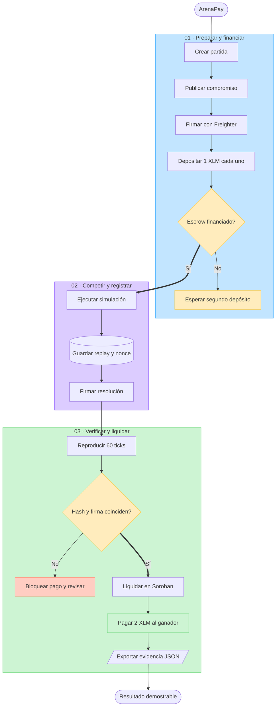

# Flujo de ArenaPay para el checkpoint de Stellar Odyssey

Este esquema resume el recorrido que se construye y demuestra en ArenaPay. La partida se prepara y financia con firmas de Freighter, se ejecuta fuera de la cadena de forma determinista y se liquida mediante el contrato Soroban después de verificar el replay, el hash y la firma del árbitro.

La lámina de presentación utiliza un formato compacto para que un visitante pueda leerla completa en una pantalla de portátil. Las tres filas representan preparación, competición y liquidación; la franja inferior enumera las pruebas que produce la demostración.

## Enlaces de referencia

- Aplicación: <https://arenapay.vercel.app/>
- Repositorio público: <https://github.com/hvaler/ArenaPay>
- Demostración completa: <https://youtu.be/LECz_vXmFi0>
- Pitch: <https://youtu.be/thcnJ7IS7fE>
- FigJam del flujo, enfocado en la lámina final: <https://www.figma.com/board/CgZaKh4wtUQk1PC4J7BfuX/ArenaPay-%E2%80%94-Flujo-verificable-en-Stellar-Testnet?node-id=9-86>

## Uso en el checkpoint

El FigJam debe compartirse como **Cualquier persona con el enlace puede ver**. En el campo **Repositorio base** se utiliza `https://github.com/hvaler/ArenaPay`. Debe indicarse que el proyecto ya existía antes del evento, porque el repositorio y las primeras versiones de ArenaPay preceden a la participación actual.
