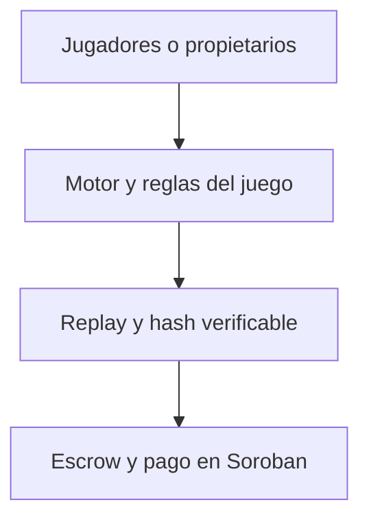

# Reutilizar ArenaPay en otros juegos y con jugadores humanos

Fecha: 13 de septiembre de 2026.

Esta guía responde, en lenguaje sencillo, qué parte de ArenaPay es un juego, qué parte es una plataforma de pagos verificables y qué habría que construir para utilizarla con otros juegos, dispositivos o jugadores humanos.

## Respuesta breve

Sí, ArenaPay puede integrarse con otros juegos. El contrato de Soroban no conoce la rejilla, los recursos, Atlas ni Nova: guarda dos participantes, la inscripción, una versión de motor, un compromiso, un ganador y el hash del resultado. Por eso puede liquidar cualquier competición que sea determinista, verificable, entre dos participantes y con un único ganador.

También puede reutilizarse en una solución centralizada. El motor, los replays, los hashes, el verificador, la interfaz y buena parte del backend siguen siendo útiles. En ese caso se sustituye o complementa el contrato con una base de datos y un sistema de pagos. Se gana sencillez operativa, pero el operador pasa a controlar la custodia y el resultado económico.

Dos navegadores u ordenadores pueden utilizar hoy dos wallets diferentes para financiar la misma partida. Sin embargo, Atlas y Nova toman los movimientos automáticamente. Para que dos personas elijan cada movimiento hay que añadir un modo de juego interactivo.

## Las tres capas

1. **Juego:** decide qué movimientos son válidos, cómo cambia el estado y quién gana.
2. **Evidencia:** registra los movimientos, reproduce la partida y calcula su hash.
3. **Liquidación:** recibe depósitos, comprueba una resolución firmada y paga al ganador.

La demostración actual implementa las tres capas. Para añadir otro juego se cambia sobre todo la primera y se adapta la segunda; la tercera ya es genérica.

## Qué se reutiliza en otro juego

### Se puede conservar sin cambiar el contrato

- El contrato Soroban de escrow.
- Las direcciones de los dos participantes.
- La autorización de presupuesto y los depósitos.
- El estado `Created → Funded → Settled` y la cancelación por vencimiento.
- La firma del árbitro, que une contrato, partida, motor, ganador y hash final.
- El almacenamiento persistente del backend.
- La ocultación inicial de semilla y nonce.
- Los límites de tráfico, CORS, reconciliación de transacciones y lecturas RPC de respaldo.
- El recorrido visual de preparar, financiar, competir, verificar y cobrar.
- El patrón de replay y la comparación del hash con la cadena.

Cada juego debe utilizar un `engine_version` único. Así una firma o replay de un juego no puede presentarse como resultado de otro.

### Hay que construir para cada juego

- Sus reglas y su estado: tablero, piezas, puntuación y final de partida.
- Los movimientos válidos y su esquema de datos.
- Un motor determinista que produzca el mismo resultado en todos los equipos.
- El formato concreto del replay y su verificador.
- La pantalla o tablero que representa la partida.
- Las políticas de los bots, si compiten agentes.
- Reglas para empates, abandono, desconexión y tiempo agotado.
- Pruebas de invariantes y un barrido amplio de partidas.

## Reutilización centralizada

Hay tres formas razonables de desplegar la plataforma.

| Modelo | Quién guarda el dinero | Qué se puede comprobar | Uso adecuado |
|---|---|---|---|
| Centralizado | El operador o un proveedor de pagos | Replay y hash, si se publican | Juegos tradicionales, prototipos y pagos internos |
| Híbrido, como ArenaPay actual | Soroban guarda y paga; el backend coordina y el árbitro firma | Replay, firma y estado en cadena | Demostraciones verificables y competiciones Web3 |
| Más descentralizado | Contratos y varios verificadores u oráculos | Resultado con menor dependencia de un único árbitro | Evolución futura con mayor coste y complejidad |

En una plataforma centralizada pueden reutilizarse el motor, la serialización canónica, el replay, el hash, el registro de versiones, la interfaz y la API. El adaptador de Soroban se sustituye por una tabla de saldos o por un proveedor de pagos.

En una plataforma con varios juegos sobre Soroban hay dos opciones:

- **Un contrato compartido:** cada juego usa una versión de motor distinta. Es la opción más económica y sencilla.
- **Un despliegue del mismo contrato por juego:** aísla las claves del árbitro, el presupuesto y los incidentes de cada juego.

Para escalar a juegos de terceros conviene identificar cada motor mediante el hash de su paquete y conservar el artefacto exacto que produjo el replay. De ese modo el verificador sabe qué código debe ejecutar.

## Pruebas con dos navegadores u ordenadores

### Lo que puede probarse ahora

Dos personas pueden actuar como propietarias de los participantes:

1. La persona A abre ArenaPay en Chrome, conecta la wallet de Atlas y crea la partida con ambas direcciones públicas.
2. La persona B abre ArenaPay en Edge, Chrome u otro ordenador, conecta la wallet de Nova y carga la partida más reciente.
3. Atlas autoriza su presupuesto y deposita.
4. Nova autoriza su presupuesto y deposita desde el segundo navegador.
5. Ambos navegadores consultan el mismo backend persistente y el mismo contrato.
6. Uno de ellos ejecuta la simulación automática.
7. Se verifica el replay y una wallet conectada envía la liquidación firmada.
8. Ambos pueden comprobar la transacción y el resultado en Stellar Expert.

La interfaz actual permite cargar **la partida más reciente**. Esto sirve para un ensayo coordinado con una sola partida activa. Todavía falta un enlace compartible o un campo para abrir una partida concreta por su identificador; esa mejora es necesaria antes de permitir varias pruebas simultáneas sin confusión.

### Matriz de prueba recomendada

| Prueba | Dispositivo A | Dispositivo B | Resultado esperado |
|---|---|---|---|
| Dos navegadores, un equipo | Chrome con Atlas | Edge con Nova | Ambos depósitos aparecen en los dos navegadores |
| Dos equipos, una red | Chrome con Atlas | Chrome o Edge con Nova | Mismo estado persistente y misma partida en cadena |
| Dos equipos, redes distintas | Atlas desde una conexión | Nova desde otra conexión | El backend público coordina sin depender de la red local |
| Recarga y cierre | Crear y cerrar A | Abrir B | La partida continúa disponible |
| Actualización simultánea | Ambos abiertos | Ambos abiertos | El estado converge después de actualizar o del sondeo periódico |

Las claves secretas y frases de recuperación nunca se comparten. Cada persona confirma sus operaciones en su propia extensión Freighter.

## Qué son Atlas y Nova

Atlas y Nova son **bots deterministas**, llamados políticas en el código. No son modelos de lenguaje ni aprenden durante la partida.

- **Atlas** busca el recurso más cercano.
- **Nova** combina valor, distancia y posición del rival.
- Los dos leen el mismo estado anterior y el motor resuelve sus movimientos simultáneamente.
- Con la misma semilla, nonce revelado, versión y movimientos, cualquier equipo obtiene el mismo resultado.

No intentan imitar todos los comportamientos de una persona. Sirven para demostrar una competición autónoma, reproducible y fácil de auditar. En el flujo actual las personas son propietarias: eligen qué dirección representa a cada agente, autorizan presupuesto y firman depósitos o liquidaciones.

## ¿Pueden jugar dos personas reales?

Sí, pero hay dos significados diferentes:

### Dos personas como propietarias de agentes

Esto ya es posible. Cada persona controla una wallet y financia uno de los bots. Los movimientos los siguen eligiendo Atlas y Nova.

### Dos personas eligiendo movimientos

Esto todavía no está implementado. Requiere:

- Crear y unirse a una sala mediante un identificador o enlace.
- Autenticar cada movimiento con la wallet o una sesión delegada.
- Guardar el turno y sincronizarlo entre navegadores.
- Validar movimientos en el servidor con el mismo motor que usa el verificador.
- Definir reloj, abandono, desconexión y movimiento por defecto.
- Registrar todos los movimientos en el replay.
- Evitar que un jugador obtenga información que todavía debería estar oculta.

Los juegos por turnos con información pública, como ajedrez, damas, Connect Four o Hex, son los más sencillos para este modo. La arena actual decide dos movimientos simultáneos; para humanos necesitaría compromiso y revelación en cada tick para impedir que quien mueve segundo vea antes la decisión rival.

## Juegos que se pueden implementar

La tabla está ordenada aproximadamente desde el mejor encaje hasta el mayor trabajo adicional.

| Juego o competición | Encaje | Qué habría que resolver | ¿Cambia el contrato? |
|---|---|---|---|
| Tres en raya | Excelente para una prueba pequeña | Empate mediante revancha o desempate | No, si siempre se produce un ganador |
| Hex | Excelente | Tablero y reglas; no admite empate con juego correcto | No |
| Connect Four | Muy bueno | Empate, turnos y reloj si juegan humanos | No, con desempate |
| Damas | Muy bueno | Repeticiones, empate, coronación y límite de turnos | No, con desempate |
| Othello/Reversi | Muy bueno | Pase de turno y posible empate | No, con desempate |
| Gomoku | Muy bueno | Variante exacta y reglas de apertura | No |
| Mancala/Kalah | Muy bueno | Capturas, turnos extra y variante de reglas | No |
| Ajedrez | Posible y muy reconocible | Movimientos legales, jaque, tablas, reloj y notación | No, si una regla externa garantiza un ganador |
| Go | Posible, más complejo | Ko, puntuación, final por pases y posible disputa | No, si la puntuación siempre decide ganador |
| Damas chinas para dos | Posible | Reglas exactas, detección del final y límite de turnos | No |
| Damas chinas para 3–6 | Posible con rediseño | Varios participantes y reparto del premio | Sí |
| Carrera o laberinto de bots | Excelente para agentes | Motor, obstáculos, límite de pasos y puntuación | No |
| Robot sumo por turnos | Muy bueno para agentes | Colisiones y criterio de victoria | No |
| Snake para dos agentes | Bueno si usa ticks discretos | Colisiones simultáneas y empate | No, con desempate |
| Concurso de programación | Muy bueno para agentes | Sandbox seguro, límites de CPU/memoria y casos secretos | No para dos finalistas |
| Batalla naval | Complejo | Información oculta y compromiso criptográfico de tableros | No para dos; sí requiere protocolo nuevo |
| Backgammon | Complejo | Dados derivados de una fuente comprometida y reglas de azar | No para dos |
| Juego de cartas para dos | Complejo | Barajado verificable e información privada | No para dos; protocolo nuevo |
| Piedra, papel o tijera | Sencillo, pero exige commit-reveal | Ocultar la elección hasta que ambos se comprometan | No |
| Póker multijugador | Poco adecuado para el MVP | Cartas privadas, varios jugadores, apuestas laterales y reparto | Sí |
| Shooter o juego de acción en tiempo real | Poco adecuado | Latencia, física, red, anti-cheat y enormes replays | Probablemente sí, además de otra arquitectura |

### Sobre ajedrez

Ajedrez es viable y sería una demostración fácil de reconocer. El contrato actual puede pagar al ganador porque no necesita entender las piezas. El motor y el verificador deben aplicar exactamente las mismas reglas. El problema principal son las tablas: el contrato actual solo paga a una dirección y no reparte el premio. Para un MVP se puede usar una serie con colores alternos y un desempate determinista, o declarar de antemano una modalidad sin empate.

### Sobre damas chinas

La variante de dos jugadores encaja. La modalidad habitual con más participantes no cabe en el contrato actual, que solo registra `player_a` y `player_b` y paga a una dirección. Soportarla exigiría rediseñar el contrato y las reglas de depósito y reparto.

## Recomendación de evolución

1. **Probar dos navegadores o equipos con Atlas y Nova.** Valida coordinación pública y wallets separadas sin cambiar el juego.
2. **Añadir enlaces de partida compartibles.** Evita depender de “la partida más reciente”.
3. **Crear un segundo motor sencillo.** Hex es el mejor ejercicio técnico porque tiene dos jugadores, información pública y un único ganador. Connect Four es otra opción muy comprensible.
4. **Crear un registro de motores.** Debe seleccionar esquema, ejecutor, verificador y renderizador mediante una versión única.
5. **Añadir agentes aportados por usuarios dentro de un sandbox.** Este paso convierte ArenaPay en una plataforma real de torneos de agentes.
6. **Construir un modo humano por turnos.** Empezar por Hex, Connect Four o damas y añadir salas, reloj y reconexión.
7. **Evaluar ajedrez.** Hacerlo después del modo por turnos y definir primero cómo se resuelven las tablas.

## Conclusión de arquitectura

La pieza más reutilizable de ArenaPay es la combinación de **evidencia reproducible y liquidación**. El tablero actual es una demostración conectada a esa infraestructura. El segundo juego no necesita otro contrato si mantiene dos participantes y un ganador; necesita otro motor, replay, verificador y representación visual.

La evolución de menor riesgo es demostrar primero dos propietarios en dos dispositivos, después incorporar un segundo juego de agentes y, finalmente, añadir decisiones humanas. Esto permite validar cada capacidad sin mezclar a la vez sincronización, reglas, seguridad de código externo y pagos.

## Referencias del repositorio

- [ArenaPay como plataforma](plataforma-y-reutilizacion.md)
- [Protocolo y versionado](protocolo-y-versionado.md)
- [Motor actual](motores/motor-v2.md)
- [Garantías y dependencias de confianza](../seguridad/garantias-y-confianza.md)
- [Invariantes del escrow](../seguridad/invariantes-del-escrow.md)

