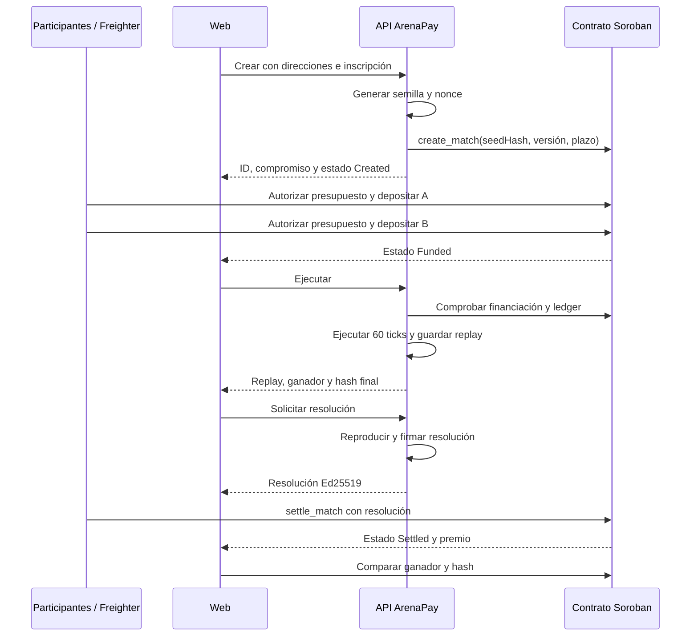

# Visión general de la arquitectura

Estado vigente: 14 de septiembre de 2026. Este documento describe el MVP desplegado. Las propuestas futuras se mantienen separadas en la [hoja de ruta](../producto/roadmap-post-hackathon.md).

## Qué hace el sistema

ArenaPay coordina una competición determinista entre Atlas y Nova, conserva una evidencia reproducible y utiliza un contrato Soroban para proteger las inscripciones y pagar al ganador. La partida se calcula fuera de cadena; la cadena registra compromisos económicos y el resultado liquidado.

## Componentes

| Componente | Responsabilidad | Persistencia |
|---|---|---|
| Web React | Práctica, tablero, replay, Freighter y comparación | Navegador para práctica |
| Paquete compartido | Registro de motores, reglas, esquemas, hashes, reproducción y adaptador RPC | Ninguna |
| Motor Node local | API de desarrollo, partidas en archivos y árbitro | `data/matches/` |
| Worker público | API operativa, límites, coordinación y árbitro | Durable Object SQLite |
| Freighter | Firma del presupuesto, depósito, devolución o cobro | Wallet del participante |
| Contrato `arena_escrow` | Presupuestos, depósitos, estados, pago y devolución | Stellar Testnet |
| RPC Stellar | Preparación, envío único y lectura de la red | Infraestructura externa |

## Flujo de una partida Testnet

## Dos clases de partida

La **práctica** se ejecuta íntegramente en el navegador en las ediciones públicas. Su semilla la elige el usuario, no escribe en Testnet y no produce un premio.

La **partida Testnet** se crea mediante la API operativa. El servidor genera semilla y nonce, conserva ambos hasta la ejecución y exige financiación confirmada antes de construir el replay.

## Compromiso, replay y firma

1. El compromiso v2 es SHA-256 del JSON canónico con versión, semilla y nonce secreto.
2. El replay revela semilla y nonce después de ejecutar e incluye 120 entradas, estado final y ganador.
3. El verificador vuelve a simular los 60 ticks y recalcula compromiso y hash final.
4. El árbitro firma una preimagen XDR que ata red, contrato, partida, compromiso, versión, ganador y hash.
5. El contrato verifica la firma y paga; no ejecuta el motor.

El replay demuestra coherencia reproducible. No demuestra selección imparcial de la semilla ni honestidad del árbitro. Esos límites están detallados en [garantías y confianza](../seguridad/garantias-y-confianza.md).

## Estados

| Capa | Estados |
|---|---|
| Registro local | `Ready → Completed` |
| Contrato | `Created → Funded → Settled` |
| Recuperación contractual | `Created → Cancelled` o `Funded → Cancelled` después del vencimiento |

`Settled` y `Cancelled` son terminales. Cancelar requiere una transacción de un participante; no ocurre automáticamente al vencer.

## Lecturas y escrituras RPC

Las lecturas pueden probar respaldos configurados y enumeran los endpoints intentados si todos fallan. La preparación y el envío utilizan el RPC principal. Una transacción firmada se envía una sola vez y después se reconcilia por su hash.

## Límites de escalabilidad actuales

- El Worker usa un único Durable Object llamado `primary`: simplifica la consistencia y limita el paralelismo.
- No existen cuentas de usuario, salas ni enlaces de partida compartibles.
- El árbitro y el administrador son autoridades únicas de Testnet.
- El contrato admite dos participantes y un solo ganador.
- La UI no automatiza la restauración de almacenamiento Soroban archivado.

## Mapa del código

| Ruta | Contenido |
|---|---|
| `src/apps/web/` | Interfaz y pruebas de componentes |
| `src/packages/shared/` | Motor, protocolo, hash y RPC |
| `src/services/match-engine/` | API Node local |
| `src/services/cloudflare-worker/` | Backend público |
| `src/contracts/arena_escrow/` | Contrato Soroban y pruebas Rust |
| `src/tests/` | Recorridos de navegador |
| `src/scripts/` | Construcción, ensayo y verificación |

## Lecturas siguientes

- [Protocolo y versionado](protocolo-y-versionado.md)
- [Motor `resource-arena/2.0.0`](motores/motor-v2.md)
- [Formato de evidencia y firmas](formato-evidencia.md)
- [API](../referencia/api.md)
- [Despliegue público](../despliegue/README.md)
- [Modelo de amenazas](../seguridad/modelo-de-amenazas.md)
