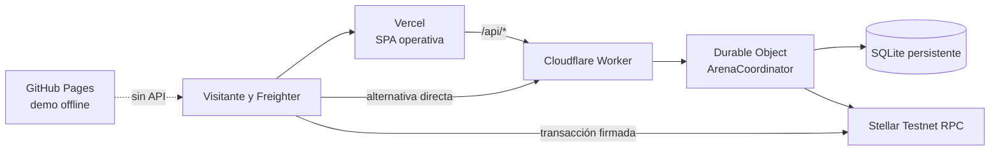

# Despliegue público de ArenaPay

Estado verificado el **14 de septiembre de 2026**:

| Destino | URL | Edición | Backend |
|---|---|---|---|
| Vercel | <https://arenapay.vercel.app/> | Operativa, URL principal | Reenvía `/api/*` a Cloudflare |
| Cloudflare | <https://arenapay.arenapay.workers.dev/> | Operativa | Worker + Durable Object SQLite |
| GitHub Pages | <https://hvaler.github.io/ArenaPay/> | Offline | Ninguno |

La [guía de modos de prueba](../guias/modos-de-prueba.md) explica qué recorrido permite cada edición. La evidencia de la publicación actual está en [publicación del 14 de septiembre](../evidencia/publicacion-2026-09-14.md).

## Arquitectura publicada



Vercel y Cloudflare sirven el panel Testnet. Cloudflare conserva semilla, nonce, relación con el contrato y replay final. Vercel no almacena secretos: su configuración solo sirve la web y reenvía la API. GitHub Pages permite practicar, importar replays y revisar evidencia existente sin wallet ni servidor.

## Por qué existen tres ediciones

- **Vercel** ofrece una dirección sencilla para el recorrido con Freighter.
- **Cloudflare** ejecuta la API y mantiene el estado entre solicitudes y despliegues.
- **GitHub Pages** sigue funcionando aunque el backend esté caído y permite una evaluación sin firmas.

GitHub Pages no puede crear partidas Testnet porque no ejecuta código de servidor ni guarda secretos. El backend Node de desarrollo tampoco debe publicarse directamente: utiliza archivos locales y su bloqueo de concurrencia vive en un solo proceso.

## Responsabilidades y fuentes de verdad

| Dato u operación | Fuente de verdad |
|---|---|
| Depósitos, estado económico, ganador liquidado | Contrato Soroban en Stellar Testnet |
| Semilla y nonce antes de ejecutar | Registro privado del Durable Object o del motor local |
| Replay después de ejecutar | Registro persistente y copia descargable |
| Claves de administrador y árbitro | Secretos de Cloudflare o `.env.testnet` local |
| Código y documentación | Rama `main` |
| Demo offline compilada | Rama `gh-pages` |

Una restauración del backend no revierte Stellar. Antes de ejecutar, firmar o cobrar después de una incidencia hay que volver a consultar el contrato.

## Orden de publicación

1. Ejecutar las pruebas y compilaciones.
2. Publicar Cloudflare y comprobar `/api/health` y `/api/testnet/config`.
3. Publicar Vercel y comprobar que su `/api/health` llega al Worker.
4. Compilar la edición offline y publicarla en `gh-pages`.
5. Ejecutar los escenarios públicos y registrar commits y versiones.

```powershell
npm ci
npm test
npm run build
npm run test:e2e
npm run test:contract
npx wrangler deploy --dry-run
```

Las instrucciones específicas están en:

- [Cloudflare Worker y Durable Object](cloudflare.md)
- [Vercel](vercel.md)
- [GitHub Pages](github-pages.md)

## Validación posterior

Comprobaciones mínimas:

- Las tres portadas responden por HTTPS.
- Vercel y Cloudflare muestran **Nueva partida en Testnet**.
- `GET /api/health` declara `mode: public` y `persistence: durable-object`.
- `GET /api/testnet/config` indica `ready: true` y no contiene claves secretas.
- GitHub Pages no solicita Freighter ni realiza peticiones a `/api`.
- El runbook HTML y Markdown se puede abrir o descargar.

Escenarios automáticos:

```powershell
npm run test:operational

$env:PUBLIC_OPERATIONAL_URL='https://arenapay.arenapay.workers.dev'
npx playwright test --config playwright.operational.config.ts

$env:PUBLIC_DEMO_URL='https://hvaler.github.io/ArenaPay/'
npx playwright test --config playwright.public.config.ts
```

`test:operational` comprueba la configuración pública y que la práctica permanece en el navegador. No crea, financia ni liquida una partida Testnet.

## Publicar cambios con seguridad

No incluir `.env.testnet`, `.dev.vars`, `data/`, claves que empiecen por `S` ni frases de recuperación. Las variables `VITE_*` forman parte del bundle y nunca deben contener secretos. Antes de publicar, revisar `git status`, los cambios del lockfile y los artefactos generados.

El Worker debe publicarse antes que una web que dependa de rutas nuevas. Si la web falla y la API sigue siendo compatible, se puede restaurar la versión anterior de Vercel. Si falla el Worker, restaurar código no modifica SQLite ni transacciones ya confirmadas.

## Recuperación resumida

1. Detener nuevas pruebas si hay riesgo de inconsistencia.
2. Guardar ID de partida, hash de transacción, ledger y hora UTC.
3. Consultar el contrato mediante un RPC Testnet.
4. Restaurar código o datos solo después de identificar qué capa falló.
5. Repetir una consulta; no reconstruir ni reenviar una operación firmada por intuición.
6. Si se perdió definitivamente semilla o nonce, esperar el vencimiento y devolver depósitos mediante `cancel_match`.

Consulta [operación y recuperación](../guias/operacion-y-recuperacion.md) para el procedimiento completo.

## Decisión registrada

La selección de Cloudflare Durable Objects para el backend persistente está registrada en [ADR-003](../adr/ADR-003-backend-publico-cloudflare.md). Las alternativas y limitaciones evaluadas durante el diseño se conservan en el historial Git; este documento describe únicamente la arquitectura vigente.
