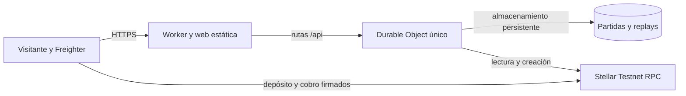

# Backend público persistente en Cloudflare

Estado: publicado inicialmente el 13 de septiembre y actualizado con ArenaPay 0.3.0 el 21 de septiembre de 2026 en **<https://arenapay.arenapay.workers.dev/>**. La versión y las pruebas públicas más recientes están en la [evidencia de publicación 0.3.0](../evidencia/publicacion-0.3.0-2026-09-21.md).

La prueba de humo creó la partida `5e449ed2-4b18-429a-bad0-ddf776473ace`, redesplegó el Worker y volvió a leerla en estado `Created` sin revelar semilla ni nonce. El registro público está en [`public-backend-evidence.json`](../evidencia/public-backend-evidence.json) y la creación puede comprobarse en [Stellar Expert](https://stellar.expert/explorer/testnet/tx/a0a18ba400da6880e8d5abc919e7ac1c7962d52099ad340f4f4034555688ebb8).

## Qué se publica

La edición operativa de Cloudflare reúne la web y la API bajo el mismo dominio HTTPS. La URL principal de Vercel sirve la misma web y reenvía `/api/*` al Worker para evitar problemas de acceso directo a `workers.dev` en algunas redes. Todas las solicitudes de la API llegan a un único **Durable Object** llamado `ArenaCoordinator`.

Un Durable Object es un pequeño coordinador con almacenamiento privado, consistente y persistente. Cloudflare puede apagar o reiniciar su proceso, pero los registros guardados sobreviven. ArenaPay conserva ahí la semilla, el nonce secreto, la relación con el contrato y el replay final. El navegador no recibe la semilla ni el nonce hasta que ya existe el replay.



La práctica sin fondos permanece en el navegador y nunca ocupa almacenamiento del servidor. GitHub Pages continúa como demostración offline. El contrato Soroban no se modifica ni se vuelve a desplegar.

## Controles activados

- HTTPS gestionado por Cloudflare.
- Un único coordinador para impedir carreras entre creaciones y ejecuciones.
- Tope global de 20 partidas pagadas por día, conservado en el almacenamiento persistente.
- Límites por visitante: 120 solicitudes por minuto, 3 creaciones, 10 ejecuciones y 20 firmas de resolución por hora.
- Lista cerrada de orígenes para las llamadas realizadas desde otros dominios.
- Las rutas de práctica del backend devuelven 404 en la edición pública.
- Los secretos del administrador, del árbitro y la sal del limitador se guardan como secretos de Cloudflare. No forman parte del repositorio ni de los archivos de la web.
- Las escrituras se envían una sola vez al RPC principal; los respaldos se usan únicamente para lecturas.

Los límites por visitante viven en memoria y vuelven a cero si Cloudflare reinicia el coordinador. El tope diario sí es persistente. Son protecciones contra abuso casual, no autenticación de usuarios.

## Archivos relevantes

| Archivo | Responsabilidad |
|---|---|
| `wrangler.jsonc` | Nombre, web estática, Durable Object y variables públicas |
| `src/services/cloudflare-worker/src/index.ts` | API, almacenamiento, límites y conexión con Testnet |
| `config/testnet.deployment.json` | Identificadores públicos saneados del contrato existente |
| `src/scripts/build-operational.mjs` | Compila la web con el panel Testnet activo |
| `vercel.json` y `config/vercel-operational.json` | Reenvían la API de Vercel al Worker persistente en ambos métodos de publicación |
| `.dev.vars` | Secretos locales ignorados por Git |

## Configuración inicial en Cloudflare

1. Accede al panel de Cloudflare con la cuenta que administrará ArenaPay.
2. Instala dependencias desde la raíz con `npm ci`.
3. Autoriza Wrangler:

   ```powershell
   npx wrangler login
   npx wrangler whoami
   ```

4. Revisa `wrangler.jsonc`. Debe declarar el Worker `arenapay`, el código en
   `src/services/cloudflare-worker/src/index.ts`, los activos en `public-operational/`, el Durable
   Object `ArenaCoordinator` y su migración SQLite `v1`.
5. Revisa las variables públicas: orígenes permitidos y tope diario. No coloques claves en `vars`.
6. Añade los secretos de forma interactiva:

   ```powershell
   npx wrangler secret put ARENAPAY_ADMIN_SECRET
   npx wrangler secret put ARENAPAY_REFEREE_SECRET
   npx wrangler secret put ARENAPAY_RATE_LIMIT_SALT
   ```

   Wrangler solicita cada valor sin guardarlo en el repositorio. La clave del árbitro debe
   corresponder con la clave pública del contrato desplegado.
7. Publica con `npm run deploy:cloudflare`. La primera publicación aplica la migración que crea el
   almacenamiento SQLite del Durable Object.
8. Conserva activada la observabilidad configurada en `wrangler.jsonc` y revisa los registros desde
   **Workers & Pages → arenapay → Observability**.

No es necesario crear manualmente una base SQLite en el panel: la vinculación y la migración están
declaradas en Wrangler. No elimines ni renombres la clase persistente sin preparar otra migración.

## Publicar desde cero

1. Instala las dependencias con `npm ci`.
2. Ejecuta `npx wrangler login` y autoriza la cuenta de Cloudflare en el navegador.
3. Compila y valida con `npm test`, `npm run build:operational` y `npx wrangler deploy --dry-run`.
4. Carga los tres secretos con `npx wrangler secret put`: `ARENAPAY_ADMIN_SECRET`, `ARENAPAY_REFEREE_SECRET` y `ARENAPAY_RATE_LIMIT_SALT`.
5. Ejecuta `npm run deploy:cloudflare`.
6. Abre `/api/health`; debe responder `mode: public` y `persistence: durable-object`.
7. Abre `/api/testnet/config`; debe indicar `ready: true` y el contrato `CDHPEYP7KEYYO3D6G44PK22MUNKF4ZBFHLOM6DUL2NOUKXNNTO4R4RID`.
8. Realiza una partida completa con dos cuentas Freighter siguiendo el runbook general.

Nunca escribas los secretos en `wrangler.jsonc`, en una variable que empiece por `VITE_`, en un comando visible o en un documento. Freighter sigue conservando las claves de los participantes; el backend solo tiene las claves de servicio de Testnet.

## Desarrollo local del Worker

Crea `.dev.vars` con las tres variables secretas y mantenlo fuera de Git. Después ejecuta:

```powershell
npm run dev:cloudflare
```

Wrangler compila la edición operativa y ofrece un entorno local. Los datos locales de Wrangler no
son la base de producción. Para comprobar persistencia pública hay que consultar una partida después
de un despliegue real, como registra la evidencia existente.

## Actualizar y revisar versiones

```powershell
npm test
npm run build:operational
npx wrangler deploy --dry-run
npm run deploy:cloudflare
```

Después de publicar, anota la versión del Worker y repite `/api/health` y `/api/testnet/config`.
Cloudflare conserva versiones anteriores del código, pero restaurar código no revierte SQLite ni
Stellar. Antes de una restauración de datos, detén nuevas partidas y contrasta el estado on-chain.

## Comprobaciones antes de una demostración

- [ ] La portada carga mediante HTTPS.
- [ ] `/api/health` responde y declara almacenamiento `durable-object`.
- [ ] `/api/testnet/config` devuelve `ready: true` y no contiene claves que empiecen por `S`.
- [ ] Los archivos compilados no contienen claves secretas Stellar.
- [ ] Una ruta `/api/matches` de práctica devuelve 404.
- [ ] Una partida recién creada no devuelve `seed` ni `nonce`.
- [ ] Reiniciar o redesplegar el Worker no elimina la partida.
- [ ] Dos cuentas Freighter pueden depositar, ejecutar, verificar y cobrar.
- [ ] El recibo final aparece como exitoso en Stellar Expert Testnet.

## Recuperación

El almacenamiento SQLite de los Durable Objects ofrece una API de recuperación a un punto anterior mediante *bookmarks*, con un historial de hasta 30 días. ArenaPay todavía no expone esa operación en su Worker: antes de usarla hay que añadir una ruta administrativa protegida o una herramienta de recuperación que invoque la API de Cloudflare. Consulta la [referencia oficial de SQLite y PITR](https://developers.cloudflare.com/durable-objects/api/sqlite-storage-api/).

Antes de restaurar, detén nuevas pruebas y conserva los identificadores de las partidas afectadas. Tras la recuperación, consulta cada partida y contrástala con `get_match` en Soroban antes de permitir ejecutar o firmar una resolución.

Una restauración no revierte Stellar. La cadena sigue siendo la fuente de verdad para depósitos, vencimiento y liquidación. Si el replay ya no puede reconstruirse, no inventes otra semilla o nonce: espera al vencimiento y usa `cancel_match` para devolver los depósitos.

## Relación con Vercel y GitHub Pages

Vercel reenvía `/api/*` al Worker mediante `vercel.json` (y su copia para publicación estática); por eso su origen debe
estar permitido en Cloudflare. GitHub Pages no llama al Worker y permanece como demo offline. Las
instrucciones completas están en [Vercel](vercel.md) y [GitHub Pages](github-pages.md).
