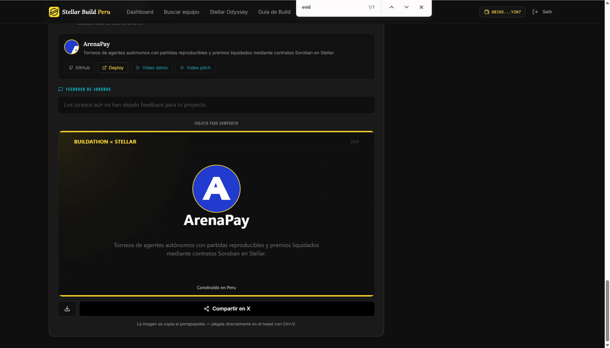

# Entrega de ArenaPay en Stellar Odyssey Perú 2026

Fecha: 20 de septiembre de 2026.

ArenaPay quedó entregado en la plataforma de Stellar Build Perú. La ficha posterior a la entrega muestra el proyecto, el repositorio, el despliegue, la demo y el vídeo pitch, además del espacio reservado para la evaluación del jurado.

## Recursos entregados

- Repositorio: <https://github.com/hvaler/ArenaPay>
- Aplicación: <https://arenapay.vercel.app/>
- Demo: <https://youtu.be/LECz_vXmFi0>
- Pitch: <https://youtu.be/thcnJ7IS7fE>
- Evidencia Testnet v2 manual: <https://stellar.expert/explorer/testnet/tx/b8f1d444402c4bcb976126b8e144eabde40b6e5dc8fb173f0a63ed178e43b448>

## Confirmación

En el momento de la captura todavía no había comentarios del jurado. La ausencia de feedback no indica un problema con la entrega.

## Actualización del 25 de septiembre de 2026

El pitch entregado el 20 de septiembre, `thcnJ7IS7fE`, ya no es público; su copia se conserva en el [archivo audiovisual](media/README.md). El pitch vigente, registrado en el Dashboard, es <https://youtu.be/4uiet8NSKwo>. El resto de recursos de esta lista no ha cambiado.
