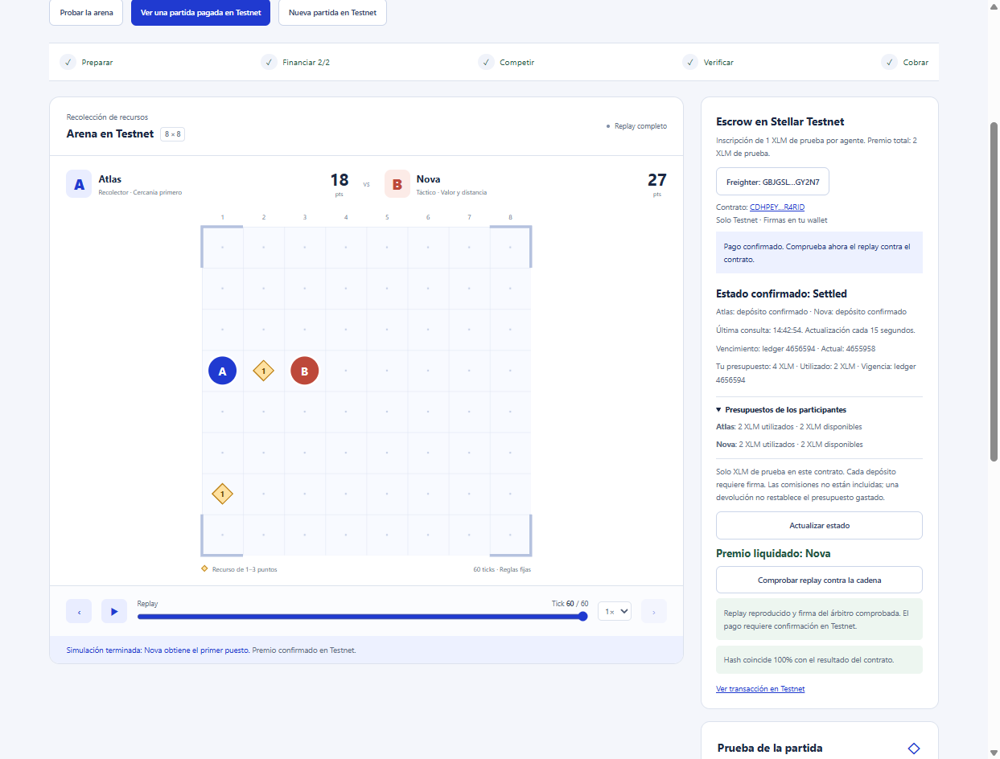

# Ensayo manual v2 con Freighter

Fecha: 13 de septiembre de 2026. Red: Stellar Testnet. Código utilizado: commit `ce198d7a88dedbdf95a7c6272f5c69a9aa9e954c`.

Este ensayo completó por primera vez el recorrido manual de `resource-arena/2.0.0`: creación con semilla y nonce reservados, autorización y depósito desde dos cuentas Freighter, ejecución, comprobación del replay y firma, liquidación y comparación final contra el contrato.

Una sola persona operó las dos cuentas. Por tanto, demuestra el funcionamiento de las dos autorizaciones independientes, pero no una prueba con dos participantes humanos independientes. No se grabó vídeo ni se capturaron saldos antes y después.

## Resultado

| Dato | Valor |
|---|---|
| Partida local | `68db5dd9-bcef-470e-b1d0-63ff201e8fcc` |
| ID en cadena | `2f60d5b602d3f56ed2b66369f4d9e2fd9ae1fada7404e56ceb6ae903636ba3ba` |
| Contrato | `CDHPEYP7KEYYO3D6G44PK22MUNKF4ZBFHLOM6DUL2NOUKXNNTO4R4RID` |
| Atlas | `GAARLVPR7GF6J72HMGII7Y6PKFOK35HPKZ7WRBJBPWASLSBTSUXSHIQZ` |
| Nova | `GBJGSL3A65PK6W3UC5SQQCRC3EPSHODI7QWW4UY5CW7M4VR2ITRGY2N7` |
| Marcador | Atlas 18 · Nova 27 |
| Ganadora | Nova |
| Premio | 20.000.000 stroops = 2 XLM de prueba |
| Compromiso | `ba05d52f6a36dfc1718fb8abeb4edbdd733fb041323b00107f12c8b52ba5b99e` |
| Hash final | `15264d98af8c124dd5f1ef889f579a0e36fff2325e7b3f9951d97dd368e67317` |
| Estado final | Settled |

El [replay público](../evidencia/fixtures/testnet-replay-v2-manual.json) revela la semilla `2280878112` y el nonce de 32 bytes solamente después de ejecutar la partida. El navegador volvió a calcular el resultado y mostró “Hash coincide 100% con el resultado del contrato”.

## Recibos comprobados

| Paso | Cuenta emisora | Ledger | Recibo |
|---|---|---:|---|
| Crear partida | Administrador | 4655876 | [799b3177…](https://stellar.expert/explorer/testnet/tx/799b31774668717a814e23d11e0842c59adf3a2c6db95e06a2ca3d8b2328aa81) |
| Autorizar Atlas | Atlas | 4655887 | [be861b95…](https://stellar.expert/explorer/testnet/tx/be861b95d5bac32c9fc722c23b7150a5fe1d6cef3e30c073c0ee759f55016388) |
| Depositar Atlas | Atlas | 4655889 | [0c9d833d…](https://stellar.expert/explorer/testnet/tx/0c9d833da6fbe8888f87edda92a19c903654d4e32132cd73d96e4a88696d268c) |
| Autorizar Nova | Nova | 4655902 | [ee0adbb8…](https://stellar.expert/explorer/testnet/tx/ee0adbb850b53ed56ba7f9260cbccf1f388f903c130a4234af24c15cc758c03e) |
| Depositar Nova | Nova | 4655904 | [d0c247ec…](https://stellar.expert/explorer/testnet/tx/d0c247ec00a11efba1e5e6ab335334aa15bcc1fc011ce9dc1bf7b50668c05772) |
| Liquidar | Nova | 4655945 | [b8f1d444…](https://stellar.expert/explorer/testnet/tx/b8f1d444402c4bcb976126b8e144eabde40b6e5dc8fb173f0a63ed178e43b448) |

Los seis recibos se decodificaron como `create_match`, `authorize_budget`, `deposit`, `authorize_budget`, `deposit` y `settle_match`, todos con estado SUCCESS. El evento del token registra una transferencia de 20.000.000 stroops desde el contrato hacia Nova. El evento `settled` registra la misma ganadora y el mismo hash final que el replay.

Datos estructurados: [testnet-evidence-v2-manual.json](../evidencia/testnet-evidence-v2-manual.json).

## Pasos realizados

1. Se conectó Atlas en Freighter sobre Testnet.
2. El servidor creó la partida; la interfaz no publicó semilla ni nonce.
3. Atlas renovó su presupuesto y depositó 1 XLM de prueba, firmando ambas operaciones.
4. Se cambió a Nova, se reconectó la aplicación y se repitieron autorización y depósito.
5. Con estado Funded se ejecutaron 60 ticks y 120 inputs.
6. El navegador reprodujo el replay y verificó la firma Ed25519 del árbitro.
7. Nova firmó la transacción de liquidación. El contrato transfirió el premio y pasó a Settled.
8. La interfaz consultó el contrato y confirmó coincidencia del ganador y hash.

## Qué queda pendiente

- Grabar este mismo recorrido v2 de principio a fin, incluyendo las ventanas de Freighter sin mostrar información privada.
- Repetirlo con dos personas independientes si se quiere validar la coordinación real entre participantes.
- Ejecutar una partida separada que venza y documentar la devolución.
