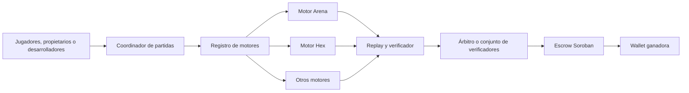

# Hoja de ruta de ArenaPay después de la hackathon

Fecha de propuesta: 13 de septiembre de 2026. Estado: **visión futura; no implementada**.

Este documento preserva una posible evolución de ArenaPay una vez cerrada la entrega de Stellar Odyssey Perú 2026. No amplía el alcance actual de la hackathon ni implica el uso de fondos reales.

## Visión

ArenaPay puede evolucionar desde una demostración de recolección entre Atlas y Nova hasta una plataforma para competiciones deterministas. Cada juego aporta sus reglas, movimientos, replay, verificador y representación; la plataforma aporta coordinación, persistencia, evidencia y liquidación.

> ArenaPay liquida competiciones verificables sobre Soroban: el replay demuestra quién ganó y el contrato paga según una resolución firmada. La arena actual es su primer motor de demostración.

La oportunidad no consiste únicamente en añadir juegos. El activo técnico es una interfaz común entre **motor reproducible**, **evidencia verificable** y **pago programable**.

## Principios que deben conservarse

- Un resultado histórico siempre se verifica con la versión exacta del motor que lo produjo.
- Los motores usan reglas deterministas, aritmética estable y ejecución acotada.
- Los usuarios conservan sus claves; cada firma se confirma en su wallet o mediante una delegación explícita y limitada.
- El replay permite recalcular el resultado sin confiar en la interfaz que lo muestra.
- El contrato permanece agnóstico al juego mientras haya dos participantes y un único ganador.
- Los fondos reales quedan fuera hasta completar auditoría, recuperación, monitorización y revisión de riesgos.
- Las funcionalidades futuras se separan del alcance demostrado para no convertir una visión en una afirmación técnica.

## Arquitectura objetivo

El registro implementado asocia una identidad inmutable con el ejecutor, el compromiso y el verificador. La siguiente ampliación debe incorporar el esquema de entrada, la representación visual y el artefacto descargable. Para motores de terceros, la opción recomendada es direccionar cada paquete por su hash criptográfico y conservar un nombre legible como metadato. Consulta la [guía para registrar un motor](../guias/registrar-un-motor.md).

## Fases propuestas

Las duraciones son rangos de planificación inicial y deben revisarse cuando exista equipo y presupuesto.

### Fase 0 — Cerrar correctamente la hackathon

Horizonte inicial: hasta la entrega y presentación.

Objetivo: conservar una entrega estable y una evidencia fácil de evaluar.

- [x] Completar el ensayo público con Freighter.
- [ ] Probar el vencimiento y la devolución.
- [x] Grabar el recorrido final.
- [x] Congelar una versión etiquetada y su evidencia.
- [x] Entregar el proyecto con repositorio, despliegue, demo, pitch y evidencia Testnet v2.
- [ ] Recoger comentarios del jurado y usuarios de prueba.

**Criterio de salida:** demo repetible, documentación coherente, transacciones contrastables y lista explícita de límites.

### Fase 1 — Uso desde dos dispositivos

Estimación inicial: 2–4 semanas.

Objetivo: convertir el ensayo con dos wallets en una experiencia compartible.

- [ ] Añadir una URL por partida, por ejemplo `/match/{id}`.
- [ ] Permitir abrir una partida concreta sin depender de “la más reciente”.
- [ ] Probar Atlas y Nova desde dos navegadores, dos equipos y redes diferentes.
- [ ] Mostrar actualización de estado y recuperación tras recargar.
- [ ] Incorporar controles de acceso para operaciones del coordinador.

**Criterio de salida:** dos propietarios independientes completan el mismo recorrido sin compartir claves, ordenador ni sesión del navegador.

### Fase 2 — Segundo juego y plataforma multimotor

Estimación inicial: 4–8 semanas.

Objetivo: demostrar que ArenaPay es reutilizable y no una aplicación ligada a la rejilla actual.

- [ ] Definir la interfaz común de un motor.
- [ ] Crear el registro de versiones y artefactos.
- [ ] Separar los esquemas de replay por motor.
- [ ] Implementar Hex o Connect Four como segundo juego.
- [ ] Añadir pruebas deterministas, vectores históricos y un barrido de partidas.
- [ ] Comparar contrato compartido frente a un despliegue por juego.

**Criterio de salida:** dos juegos distintos crean, reproducen y liquidan partidas mediante la misma capa de plataforma.

Hex es el primer candidato técnico porque tiene dos jugadores, información pública y un único ganador. Connect Four ofrece una demostración más familiar, pero necesita definir el tratamiento del empate.

### Fase 3 — Agentes aportados por terceros

Estimación inicial: 8–16 semanas para un piloto limitado.

Objetivo: permitir que desarrolladores inscriban estrategias propias.

- [ ] Publicar un SDK y una especificación de agente.
- [ ] Ejecutar código externo en un sandbox sin red, archivos ni reloj.
- [ ] Limitar CPU, memoria, tamaño y duración.
- [ ] Comprobar automáticamente construcciones no deterministas.
- [ ] Firmar o identificar por contenido el paquete presentado.
- [ ] Registrar versión del agente, entradas, salida y errores en el replay.
- [ ] Crear un entorno local de entrenamiento y validación.

**Criterio de salida:** dos desarrolladores independientes presentan agentes y un tercero reproduce la competición con los mismos artefactos.

Esta fase es el mayor reto técnico. Ejecutar código ajeno de manera segura, acotada y reproducible requiere un diseño específico y una auditoría propia.

### Fase 4 — Jugadores humanos

Estimación inicial: 8–12 semanas después de estabilizar la plataforma multimotor.

Objetivo: permitir que dos personas elijan los movimientos.

- [ ] Crear salas e invitaciones.
- [ ] Implementar turnos, reloj, reconexión, abandono y movimientos por defecto.
- [ ] Autorizar sesiones limitadas para evitar una confirmación de wallet por movimiento.
- [ ] Guardar cada decisión en el replay.
- [ ] Definir reglas de empate y desempate compatibles con el pago.
- [ ] Empezar con Hex, Connect Four o damas.
- [ ] Evaluar ajedrez cuando la infraestructura por turnos sea estable.

**Criterio de salida:** dos jugadores en dispositivos separados completan una partida interactiva y cualquier tercero puede reproducirla.

La arena simultánea actual necesitaría compromiso y revelación por tick para jugadores humanos. Los juegos por turnos con información pública evitan inicialmente esa complejidad.

### Fase 5 — Pilotos y preparación de producción

Estimación inicial: 3–6 meses, condicionada por auditorías, pilotos y alcance regulatorio.

Objetivo: obtener uso real controlado y reunir la evidencia necesaria antes de considerar fondos reales.

- [ ] Ejecutar pilotos sin fondos reales con comunidades, estudios o laboratorios.
- [ ] Añadir métricas, alertas, copias de seguridad y simulacros de recuperación.
- [ ] Diseñar rotación de claves y reducir la dependencia de un árbitro único.
- [ ] Encargar auditorías independientes del contrato, backend, sandbox y flujo de firmas.
- [ ] Definir disputas, soporte, privacidad y respuesta ante incidentes.
- [ ] Revisar requisitos legales y fiscales en las jurisdicciones objetivo.
- [ ] Completar todos los [criterios para producción](../seguridad/criterios-para-produccion.md).

**Criterio de salida:** pilotos repetibles, riesgos aceptados de forma explícita y auditorías sin bloqueos críticos abiertos.

## Catálogo inicial de juegos

| Prioridad | Juego | Razón |
|---|---|---|
| 1 | Hex | Dos jugadores, información pública y sin empate |
| 2 | Connect Four | Familiar, visual y pequeño; requiere regla de desempate |
| 3 | Damas | Buen paso hacia turnos humanos; requiere reglas de tablas |
| 4 | Othello/Reversi | Estado compacto y verificación clara |
| 5 | Ajedrez | Gran reconocimiento, pero reglas, reloj y tablas elevan el coste |
| 6 | Damas chinas para dos | Compatible con el contrato actual |
| 7 | Carreras, laberintos o robot sumo | Muy adecuados para agentes programados |

La lista ampliada, con juegos de azar, información oculta y multijugador, está en [Reutilizar ArenaPay en otros juegos y con jugadores humanos](../arquitectura/reutilizacion-juegos-y-jugadores.md).

## Hipótesis de producto que hay que validar

- Los desarrolladores quieren demostrar públicamente que su agente ganó bajo reglas conocidas.
- Organizadores de torneos necesitan pagos y evidencia sin desarrollar su propio escrow.
- Un replay verificable aporta valor suficiente frente a un marcador tradicional.
- Las wallets pueden incorporarse sin hacer pesada la experiencia de juego.
- Existe demanda para un SDK multimotor y para torneos patrocinados.
- El coste operativo y de auditoría permite un modelo sostenible.

Estas hipótesis no deben darse por probadas a partir de una hackathon. Cada fase debe incluir entrevistas, pruebas de uso y métricas.

## Posibles usuarios y clientes

- Comunidades de programación competitiva.
- Equipos que desarrollan agentes autónomos.
- Hackathons y programas educativos.
- Estudios de juegos que quieran torneos verificables.
- Comunidades Web3 que organicen competiciones patrocinadas.
- Laboratorios de investigación que necesiten resultados reproducibles.
- Patrocinadores que quieran premios públicos y auditables.

## Modelos de sostenibilidad que se podrían estudiar

- Tarifa por torneo o por partida liquidada.
- Suscripción para organizadores con panel, métricas y soporte.
- Torneos patrocinados.
- Licencia o servicio gestionado para estudios y comunidades.
- Infraestructura de verificación como API.
- Marketplace de agentes o motores, solo después de resolver seguridad y propiedad intelectual.

No se ha validado todavía disposición a pagar. La monetización debe probarse con pilotos antes de diseñar economía o token propios.

## Estrategia de financiación

### Etapa 1 — Financiación no dilutiva

Adecuada después de la hackathon y antes de tener ingresos:

- Premios de la propia hackathon.
- Grants de ecosistemas blockchain, infraestructura verificable, juegos o agentes.
- Programas universitarios y de investigación sobre reproducibilidad.
- Créditos de proveedores de infraestructura.
- Patrocinios pequeños para un segundo juego o torneo piloto.

La disponibilidad y las condiciones de cada programa cambian; deben investigarse en el momento de presentar la solicitud.

### Etapa 2 — Pilotos financiados

Una comunidad, estudio, laboratorio o patrocinador financia una prueba concreta. El objetivo es conseguir usuarios, aprender y obtener una referencia pública, no escalar antes de tiempo.

Entregables adecuados para un piloto:

- Motor y reglas acordadas.
- Torneo en Testnet o sin fondos reales.
- Panel para participantes y organizador.
- Evidencia y replays exportables.
- Informe de resultados y costes.

### Etapa 3 — Aceleradora, ángeles o pre-semilla

Tiene sentido cuando ya existan un segundo juego, usuarios externos y señales de repetición. El capital financiaría seguridad, SDK, sandbox, experiencia multiusuario, ventas y operación.

Antes de buscar inversión conviene poder responder con datos:

- Cuántos torneos y partidas se completan.
- Cuántos organizadores repiten.
- Cuántos agentes o motores externos se integran.
- Cuánto cuesta ejecutar y verificar una partida.
- Cuánto tardan dos usuarios nuevos en completar el recorrido.
- Qué parte del proceso requiere soporte manual.

## Paquete para solicitar financiación

- [ ] Demo pública estable y vídeo de tres a cinco minutos.
- [ ] Una frase de producto coherente con lo demostrado.
- [ ] Repositorio, licencia y arquitectura comprensibles.
- [ ] Evidencia Testnet y hashes reproducibles.
- [ ] Informe de seguridad, amenazas y límites.
- [ ] Hoja de ruta con hitos y uso de fondos.
- [ ] Segundo motor o prototipo multimotor.
- [ ] Resultados de entrevistas y pilotos.
- [ ] Métricas de uso y coste.
- [ ] Presentación breve para grants, socios o inversores.

## Uso orientativo de fondos

En lugar de fijar ahora una cantidad, conviene presupuestar por bloques:

| Bloque | Resultado financiable |
|---|---|
| Producto | Salas, enlaces, panel del organizador y experiencia multiusuario |
| Plataforma | Registro de motores, SDK, replays versionados y APIs |
| Seguridad | Sandbox, auditorías, gestión de claves y pruebas adversariales |
| Infraestructura | Persistencia, observabilidad, copias y recuperación |
| Pilotos | Integración, soporte, documentación y torneos iniciales |
| Operación | Aspectos legales, privacidad, soporte y administración |

Cada solicitud debe relacionar el dinero con un entregable verificable y un criterio de salida.

## Riesgos para una propuesta de financiación

| Riesgo | Respuesta propuesta |
|---|---|
| Presentar bots simples como IA avanzada | Describirlos como políticas deterministas y mostrar el plan para agentes externos |
| Depender de un árbitro único | Explicar la confianza actual y financiar su reducción por etapas |
| Añadir muchos juegos sin plataforma común | Construir primero la interfaz y el registro de motores |
| Usar fondos reales demasiado pronto | Mantener Testnet hasta completar criterios de producción y auditorías |
| No demostrar demanda | Priorizar pilotos y repetición antes de escalar infraestructura |
| Confundir replay con consenso descentralizado | Explicar qué comprueba cada capa y qué sigue dependiendo del operador |
| Ejecutar código de terceros sin aislamiento | Tratar el sandbox como un producto de seguridad, no como una tarea secundaria |

## Decisiones que se posponen deliberadamente

- Mainnet o cualquier uso con fondos reales.
- Token propio.
- Reparto de premios entre varios ganadores.
- Contrato para más de dos participantes.
- Mercado abierto de agentes.
- Gobernanza descentralizada.
- Sustitución del árbitro único.

Estas decisiones requieren evidencia de uso y una revisión independiente; resolverlas ahora distraería del cierre de la hackathon.

## Próxima revisión

Al terminar la hackathon:

1. Registrar resultado, comentarios y material presentado.
2. Reordenar esta hoja de ruta según lo aprendido.
3. Elegir entre Hex y Connect Four como segundo motor.
4. Definir el piloto más pequeño que pueda validar interés externo.
5. Investigar convocatorias de financiación abiertas en ese momento.
6. Preparar un presupuesto por hitos, no una cifra aislada.

## Documentos relacionados

- [Reutilización, dispositivos, agentes y catálogo de juegos](../arquitectura/reutilizacion-juegos-y-jugadores.md)
- [Análisis de ArenaPay como plataforma](../arquitectura/plataforma-y-reutilizacion.md)
- [Próximos pasos del MVP](proximos-pasos.md)
- [Estado y límites actuales](estado-y-limites.md)
- [Criterios para producción](../seguridad/criterios-para-produccion.md)
- [Modelo de amenazas](../seguridad/modelo-de-amenazas.md)
